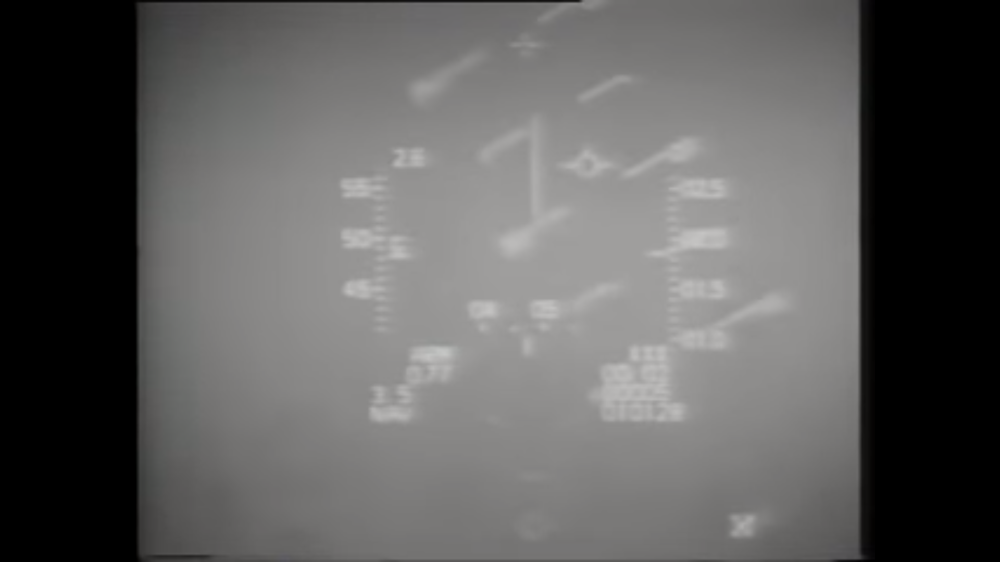
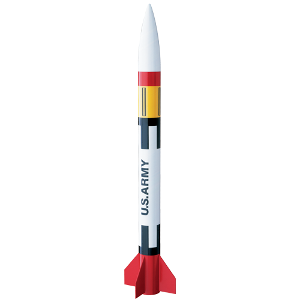
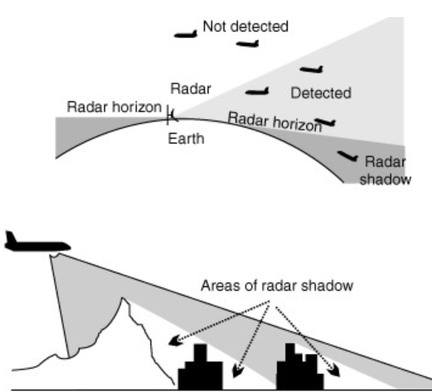
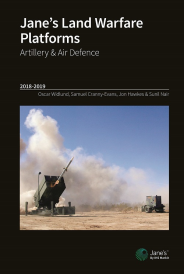
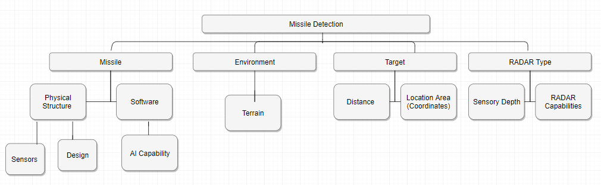
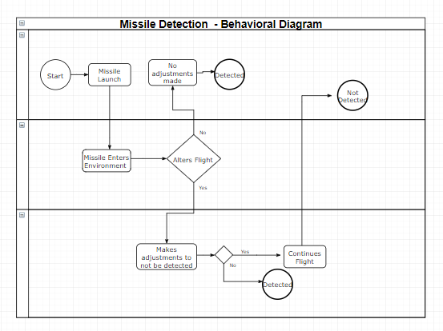
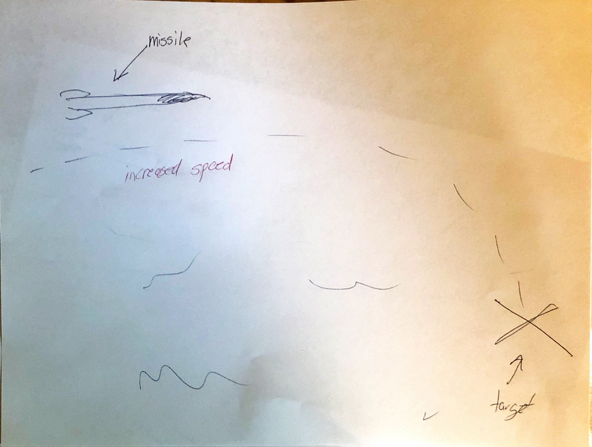
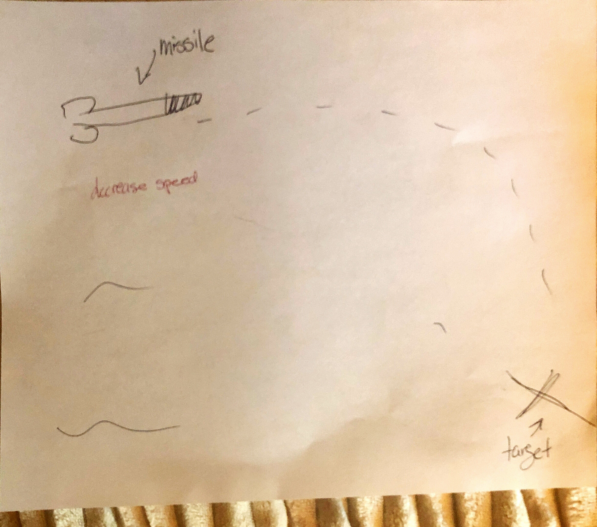

# IDS6145(SimTech 2019) - Research Plan 

> * Group Name: Incognito Missiles
> * Group participants names: Nick Armendariz, Jay Havekost, Na’Kiya Russell, and Gabby Vasquez
> * Project Title: Undetected Missiles

## ABSTRACT:
Radio Detection and Ranging (RADAR) tools are esstenial in detecting phenomon that humans cannot calculate on their own to predict future events or accruaretly locate the position of certain objects (i.e., buildings or landmarks). While RADAR tools are deemed to be useful, they are only able to detect a low-flying object until a certain ground level because of the natural curvature of the Earth. For this investigation, we choose to use RADAR tools to explore the depths of the detection and range of missiles in flight by simulating a missle to “fly under the radar” of its enemies’ defense. -insert a short sentences on findings here- Future directions focus on possible methods to improve ecological validity for future runs of this simulation. 

On June 7, 1981, nearly four decades ago, the Israeli Air Force launched a strike known as Operation Opera into Iraq.  During a hostile time, when Iraq was already at war with Iran, Israeli forces knew this would be no easy task.  However, they planned and executed what is considered one of the most successful low-ingress air strikes to date (Kirschenbaum, 2010.  

The target was against Iraqi nuclear reactors which were under construction, but due to the unsuccessful Operation Scorch Sword the year prior, Israel knew that it must approach this attack differently.  

They decided to go with a low-level ingress of the strike, due to the Anti-Air Defense systems made up on anti-air artillery as well as an Integrated Air Defense System (IADS) made up of multiple Surface to Air Missile (SAM) systems, which utilized radar to identify, track, and destroy enemy aircraft.  Putting the political ramifications aside on what the attack meant for stability in the region, it is widely viewed as a success as all of the Israeli aircraft and crews returned successfully, after destroying their targets.

## General Introduction

### Motivation

The motivation for this topic is simple - **preservation of life**.  Whether it is the ship, jet, or the missile itself delivering the projectile to the target, every component becomes vulnerable to detection and thus retalliation and potentially death.  The advent of technology, as well as tracking systems has worked very hard over the last century to provide munitions that reduce collateral damage (Brooks, et.al, 2004).  These windows have gone from having Circular Error Probables (CEP) of hundreds to thousands of feet, to less than a foot.  Regardless of the tracking mechanism though, if a missile, bomb, or other munition is detected, it could be eliminated by intercepting it.

### Real World Examples

The conflicts in the middle east from Operation Desert Shield until the initial push into Iraq at the start of Operation Iraqi Freedom demonstrated the importance of going undetected.  SAM systems are continuing their advancement in abilities to track and shoot down aircraft, which not only derails the mission success, but also costs human life.  Over the decades prior, the prevalence of these SAM systems has dwindled due to advances in Stealth technology, and the costs of maintaining these systems.  Second and Third world nations, such as Afghanistan found themselves instead relying on should fired rockets and SAMs which were less accurate and costly on the black market.  Tactics, Techniques, and Procedures (TTP) from the US Military since the Vietnam and Korean War where aircraft losses due to IADS were many have improved over time to reduce loss of life.  

To put this in comparison, during Operation Enduring Freedom in 2001 and 2002, due to weak air defenses, not a single U.S. Air Force aircraft was lost.  Compared to a ten year period between 1990 and 2000, seventeen (17) were lost due to combat in Iraq and the former Yugoslavia (Haulman, 2002).  In Desert Storm, in 1991, 14 of the 17 in the decade were lost, which had risky odds with roughly 16,000 SAM systems, 7,000 anti-aircraft guns, and 750 enemy aircraft.  However, of these 17, 13 were lost by RADAR guided missiles. 

With this in mind, the more that technology advances, the more that the developers of systems need to work towards two goals:  (1) enhance the lethality of the weapon; (2) ensure that the likelihood of striking the correct target is high.  The first of these two goals will not matter if the missile never reaches it's target.

### A Little on RADAR

RADAR tools are critical in the detection of objects (e.g., weather changes, threats within a range, etc.). Particularly, RADAR tools are primary used for forecasting the weather and detecting other phenomenon (i.e., the location of nearby buildings and other landmarks) that cannot be predicted by humans. It is the use of this type of technology that humans are able to make such predictions and succeed in calculating such events. With the current trajectory of RADAR tools, the detection of objects are constrained to a certain range. Specifically, in the aspect of objects flying at low altitudes. Due to detection being at a maximum ground level point, this allows for potential objects to fly under the RADAR’s detection. Without the ability to detect objects under a certain range can be a grave threat. Also, understand more about the area/location of RADAR and their structure (infographics) can contribute to a better approach to this problem. 

### Interest in Our Exploration

We are interested in exploring how different terrains effect RADAR detection, how the model or framework of RADAR can be reconstructed or manipulated to enable detection of the current undetected range, or investigating what other technologies that can be implemented to aid the problem. Additionally, this type of research can change how security and military operates on a daily basis. Nonetheless, RADAR has the ability to produce other key components of technology such as self-driving systems, therefore solving this issues may be a breakthrough in other technologies as well. 

The possibilites are two fold in this situation because by attempting to find a means to deliver a payload undetected by exploiting the side lobes or shorter detection ranges of some RADAR-guided systems, or to work RADAR systems to fix their gaps in capability, it is a double-edged sword.  Finding a new capability to use, means also finding a gap to fix before the enemy can exploit.
 
 **Proposed Solution**
 
 
 
This model will be different for the community because it will combine existing knowledge that exists on threats, but focused on the munitions (missiles) versus the typical though of aircraft, with regard to radar threats.  Institutional knowledge provides parameters, ranges, and windows of how a system might operate or detect a threat, but knowing the actual pattern of flight is not typically known.  WIth the increasing cost of these weapons, it is imoprtant for a battle commander to understand the risks and probabilities of success prior to launch.  The key change in this model and attempt is to allow the weapon to adjust based on Above Ground Level (AGL) altitude **AND** any perceived threats in it's path.  

This project makes the following contributions:
* Provides model that will more accurately depict a missile's flight path in conjunction with known or perceived threats
* Provide the battle commander with precise targeting solutions that will both increase likelihood of target hit and Probability of Kill
* Provide a model with an authoring tool allowing aircrew, and commanders alike to utilize the tool dependent on individual unit needs

## The Model
   
  
   
  
  The model we have provided is a good abtraction of the problem we want to study because it illustrates the important components we want to evaluate during a simulation. In addition, the behavioral model depicts how the simulation would run in a big picture view. With the specs of the structural diagram, it shows what is necessary to consider for the behavioral diagram and the overall structure of the simulation. 
  

**Anticipated Requirements for the Model:**

1. The model shall provide the ability to receive data inputs from multiple airframes.
2. The model shall have the ability to run on Government computing systems and ability to obtain an Authority To Operate on Government Networks.
3. The model should provide resultant targeting solutions with the following outputs:
   - Circular Error Probable
   - Time to Impact
   - Min and Max Altitude 
   - Fuel burn
   - Min and Max Speed
   - Max G's on Missile
4.  The model must be interoperable among Mission Planning Systems (MPS) across services and platforms.
5.  The model must be interoperable with common Geospatial Data software and mapping systems.
6.  The model should have portability to run on a stand-alone machine, as well as without internet connection.
7.  The model shall incorporate a visualization of the flight pattern of the proposed strike mission.
8.  The model should report data points along the route of flight where flight is most inefficient due to over-G, fuel rate, or a requirement to exceed flight envelope.
9.  The model should return a probability of kill for the proposed strike routes.
10. The model shall provide threat envelopes, and mimic current threat elevation data from Surface to Air Missile (SAM) systems, as well as Early Warning Radar, and common Air Traffic Control radar
11.  The model shall have the ability to provide terrain masking data along the proposed flight path

**Proposal Requirements**
For the Purposes of the proposal, the model simulation will: 
1. Demonstrate the adaptable nature of the model (authoring tools and inputs)
2. Provide a walk-through of the process and timeline an operator must take to correctly input information to run a simulation
3. Provide an overview of the weapons and aircraft available for the simulation
4. Run no less than three separate simulations demonstrating at least two different munitions.
5. Demonstrate the visualization of the route of flight for the missile

## Fundamental Questions
1. Given a weapon system and a threat detection envelope, can the weapon system execute a strike on a target, while avoiding a particular threat detection?
2. What are the resource requirements (fuel, hydraulic fluid, etc.) needed to allow for max adaptability during a weapon flight to strike target successfully?
3. Will the simulation provide near precise results when compared to actual flight data?
4. What are the differences of Time To Impact (TTI) and Time of Flight (ToF) of a given munition utilizing this model vs. a typical launch operation?
5. Will it be possible for a weapon to self-adjust during flight path execution, given obstacles of terrain, and airborne objects within a set threshold distance?

## Expected Results
[IMG-1316.JPG](images/IMG-1316.jpg)

1. Given the missile  input variables (i.e., speed and turn rate), we hypothesis that the missile will be capable of hitting a designated target whist maintaining an altitude that allows it to mitigate sensor derection.
2. When the speed of the missile increases, we predict that the missile may need to make adjustments to its' path, but will still have the capabiity to maintain an altitude close to lower speeds.
3. As for decreasing speed, we believe that the missile will not experience issues with maintaining altitudes.

## Research Methods
For this simulation we are running an agent-based and contoinous-based simulation. This simulation employs aspects of both types of simulation that we believe best fits the model that we are testing for our simulation. By definition, an agent-based simulation utalizes a style of modeling that demostartes the interactions between individuals (or agents) and their environment. These interactions are explicitly represented in a program or even in another physical entity such as a robot. For our simulation, we are intertested in exploring the interactions of the missile and the terrian that the missile is to be working within. The missile is being represented as an agent that is travelling to another location and is to "communicate" with other missiles within range. The missile is also required to have the intelligence to understand its position in the air and its' distance to the ground to ensure it does not expereince unexpected collisions with the ground or other surrounding objects (i.e., buildings, other missiles, etc.).   
By utilizing this simulation method, we can accruately predict the movements of the missile during flight and see how such a missile is able operate in such an environment. Agewnt-based simulation allows the ability to understand how potential collosions can influence in elvation rate of the missile and what factors can influence its pitch, speed, and mean elvation rate. We were also interested in incvestoigating how these collisions would impadt the missiles' ability to stay on track and complete its' mission. These factors are important when wanting to employ these missiles for a mission and selling these missions to potential stakeholders that will be using them.   
For the purpose of experimentation and further understadning of the missiles' movements, we had also employed a continous-based simulation. Continious-based simulation refers to a computer model of a physical system that continuously tracks system response according to a set of equations typically involving differential equations. Due to the nature of the missile, it is important to be able to track the movements of the missile at every second of its' flight. This provides a means to understand how different terrian can influence the missiles' elavation in flight. More speficially, how the environment will cause the missle to decrease or increase in elvation.     
For this experiemnt, the Unity gaming platform was used to simulate our model. Unity ios a cross-platform, real-time gaiming engine that allows users to build simulations and games or use pre-made packages that can be ran without any further preparations. The primary interest in using Unity was the engine's capability in creating both three-dimensional and two-dimensional games as well as simulations for many platforms. For this experiment, we were interested in creating an environment that would best fit the environment that these missiles would be deployed in and increase the ecological validity of this experiment. 

## Discussion/ Future Work
Given the time frame, we had only allowed ourselves to experiment within a two dimensional environment. While the two-dimensional enviornment does help to better demostarte how these missisles will act in these environments, but using an three-dimensioanl environment will allows us to conduct experimentation within environments that are more similar to what we will experience. This includes environmental factors (e.g., trees, mountains, etc.) and human factors (e.g. buildings and other man made structures that can interfer will missile deployment.)   
We had also idenitifed other experimental limitations within Unity gaming platform. We primaryily had ran into issues setting up and running raycasters. Raycasters is a method for detecting where current input events need to be sent to for the event system. Given a screen space position, they will collect all potential targets, figure out if they are under the given position, and then return the object that is closest to the screen. When a raycaster is present and enabled in the scene it will be used by the event system whenever a query is issued from an input module. This feature was important for us to run our simulation, but the issue with setting up the raycasters was that multiple were required. When multiple raycasters are employed, all have casting happen against another which then results in a sorting scheme based on the distance to the elements. This had caused our missile to be "confused" such that it was not sure how to get back on the flight path when it had hit an element in the environment. While we were able to fix this issue, this had caused delays on experimentation and decrease the fidelity of the simulation. Issues had arise when editing child elements in the simulation. Changes can be made to a child element; however, if major changes are made, then the parent element of the child element can be negatively impacted such that the parent will not operate as it was programmed to do so.   
Given the issues we had encountered during the development stage of the simulation, future experimentation should focus on validting our proposed model and increase the ecological validity of the simulation. Future investigations should consider recreating the model using othe gaming engines (i.e., the Unreal game engine) and compare them to our Unity simulation to see if both simulations provide similar outputs. Furthermore, more consideration should have been give the the features being used in Unity. These feature suffice and provided us with a means for experimentation; however, this had caused delays in our simulation run. If granted more time, the simulation could then be built to mimic the environment and behavior of a missile in flight.   
As for the simulation itself, we would like to employ multiple missles for future builds of this simulation. Our experiment is currently lacking such that we only have a singular missile being launched. Real world application for these types of systems usually have multiple missles being launched at the same time. When trying to adovacate for these systems, it it important to ighlight their usability in the field and ensure that they can work when multiple missiles are being lauched in the same environment. This will also allow for use to explore the behavior of multiple missiles and observe how they react to another in the environment. We also adovcate for RADARS in the scene to create detection zones. Our current simulation allows for missiles to be alerted when detected since it relies on the elevations of the missile. This can improve the readings given off by the missiles in flight. 

## References
Brooks, H., DeKeyser, T., Jaskot, D., Sibert, D., Sledd, R., Stilwell, W., & Scherer, W. (2004, April). Using agent-based simulation to reduce collateral damage during military operations. In Proceedings of the 2004 IEEE Systems and Information Engineering Design Symposium, 2004. (pp. 71-77). IEEE.

Haulman, D. L. (2002). USAF manned aircraft combat Losses 1990-2002. AIR FORCE HISTORICAL RESEARCH AGENCY MAXWELL AFB AL.

Kirschenbaum, J. (2010). Operation Opera: an Ambiguous Success. Journal of   Strategic Security, 3(4), 49-62.
